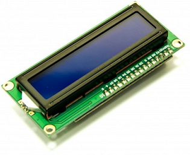

# LCD1602 
LCD1602 I2C driver for TiJOS

| 条目       | 说明                               |
| ---------- | ---------------------------------- |
| 驱动名称   | 1602 I2C LCD液晶屏模块             |
| 适用       | 该驱动适用于IIC/I2C 1602液晶屏模块 |
| 通讯方式   | I2C                                |
| Java Class | TiLCD1602.java                     |
| 图片       |       |